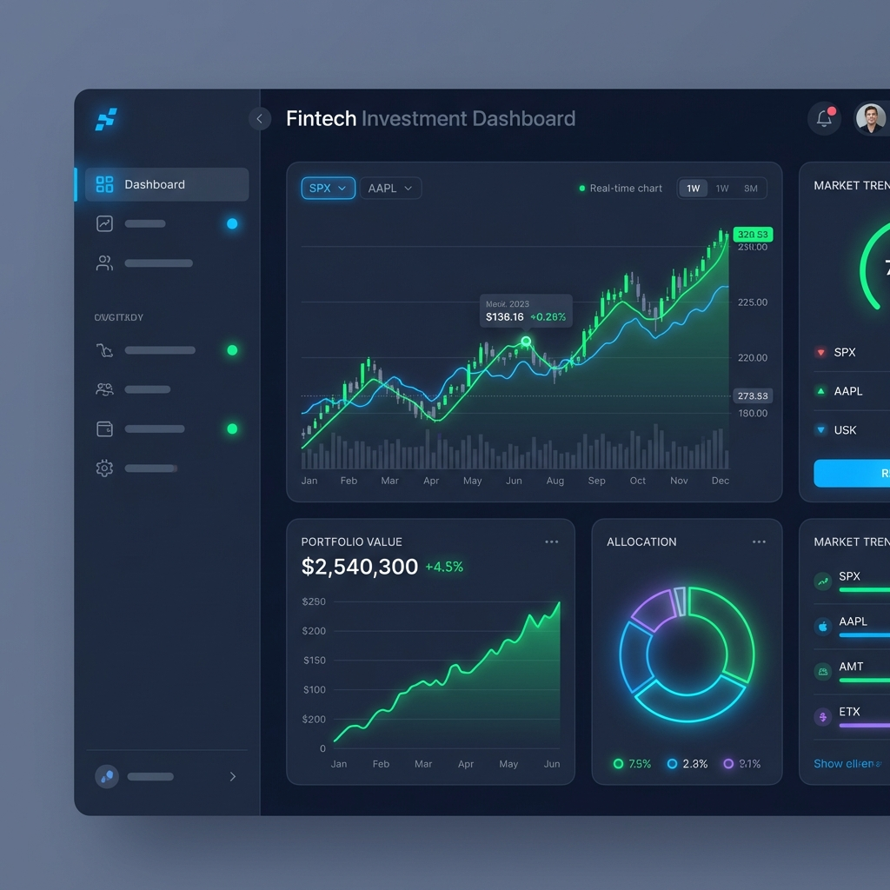

<div align="center">

# 📈 Smart Investment Dashboard

### Professional-grade investment analytics for retail investors

[](https://reactjs.org/)
[](https://nodejs.org/)
[](https://www.postgresql.org/)
[](https://www.docker.com/)
[](https://aws.amazon.com/)

[Live Demo](https://github.com/Deepanshu8560/Smart-Investment-Dashboard) • [Report Bug](https://github.com/Deepanshu8560/Smart-Investment-Dashboard/issues) • [Request Feature](https://github.com/Deepanshu8560/Smart-Investment-Dashboard/issues)



</div>

---

## ✨ Features

### 📊 **Real-Time Market Analytics**
- Live stock price tracking with millisecond precision
- Interactive charts powered by Recharts
- Advanced time-series visualization
- Real-time WebSocket data streaming

### 💼 **Portfolio Management**
- Track multiple asset portfolios
- Detailed performance metrics
- Risk exposure analysis
- Asset allocation visualization
- Historical performance tracking

### 🔐 **Secure Authentication**
- JWT-based authentication system
- Password hashing with bcrypt
- Protected API routes
- Session management
- Role-based access control

### 📈 **Trade Simulation**
- Paper trading environment
- Real-time market data integration
- Trade history tracking
- Portfolio impact simulation
- Risk-free strategy testing

### 🎨 **Premium User Interface**
- Sleek dark mode design
- Responsive layout (mobile, tablet, desktop)
- Smooth animations with Framer Motion
- Tailwind CSS for modern styling
- Glassmorphism effects

### ⚙️ **Comprehensive Settings**
- Profile management
- Security settings (2FA, password reset)
- Notification preferences
- Display customization
- Integration settings
- Billing & subscription management

---

## 🚀 Tech Stack

### **Frontend**
- **React 19.2** - Component-based UI library
- **React Router** - Client-side routing
- **Recharts** - Data visualization
- **Framer Motion** - Smooth animations
- **Lucide React** - Beautiful icons
- **Tailwind CSS** - Utility-first styling
- **Vite** - Lightning-fast build tool

### **Backend**
- **Node.js** - JavaScript runtime
- **Express 5** - Web application framework
- **PostgreSQL** - Relational database
- **WebSockets (WS)** - Real-time communication
- **JWT** - Secure authentication
- **bcrypt** - Password encryption

### **DevOps & Deployment**
- **Docker** - Containerization
- **AWS EC2/ECS** - Cloud hosting
- **AWS RDS** - Managed PostgreSQL
- **AWS S3 + CloudFront** - Frontend delivery
- **Jenkins** - CI/CD automation
- **AWS CodePipeline** - Deployment pipeline

---

## 📁 Project Structure

```
smart-investment-dashboard/
├── src/
│   ├── components/           # Reusable UI components
│   │   ├── ChartWidget.jsx
│   │   ├── Navbar.jsx
│   │   ├── TradePanel.jsx
│   │   └── settings/         # Settings page components
│   ├── pages/                # Route pages
│   │   ├── LandingPage.jsx
│   │   ├── Dashboard.jsx
│   │   ├── Portfolio.jsx
│   │   ├── AuthPage.jsx
│   │   └── Settings.jsx
│   ├── context/              # React Context providers
│   │   └── AuthContext.jsx
│   ├── services/             # API integration
│   │   └── api.js
│   ├── App.jsx               # Root component
│   ├── main.jsx              # Entry point
│   └── index.css             # Global styles
├── public/                   # Static assets
├── server.js                 # Express backend server
├── Dockerfile                # Docker configuration
├── Jenkinsfile               # CI/CD pipeline
├── buildspec.yml             # AWS CodeBuild config
├── package.json
└── vite.config.js
```

---

## 🛠️ Installation & Setup

### Prerequisites

- **Node.js** >= 18.x
- **PostgreSQL** >= 14.x
- **npm** or **yarn**
- **Docker** (optional, for containerization)

### 1️⃣ Clone the Repository

```bash
git clone https://github.com/Deepanshu8560/Smart-Investment-Dashboard.git
cd Smart-Investment-Dashboard
```

### 2️⃣ Install Dependencies

```bash
npm install
```

### 3️⃣ Environment Configuration

Create a `.env` file in the root directory:

```env
# Database Configuration
DB_HOST=localhost
DB_PORT=5432
DB_NAME=investment_dashboard
DB_USER=your_username
DB_PASSWORD=your_password

# Server Configuration
PORT=3000
NODE_ENV=development

# JWT Secret
JWT_SECRET=your_super_secret_jwt_key_here

# External APIs (optional)
MARKET_DATA_API_KEY=your_api_key
```

### 4️⃣ Database Setup

```bash
# Create PostgreSQL database
psql -U postgres
CREATE DATABASE investment_dashboard;

# Run migrations (if applicable)
npm run migrate
```

### 5️⃣ Run the Application

#### Development Mode (Frontend + Backend concurrently)
```bash
npm run dev
```

#### Run Backend Only
```bash
npm run server
```

#### Run Frontend Only
```bash
npm run client
```

#### Production Build
```bash
npm run build
npm start
```

The application will be available at:
- **Frontend**: http://localhost:5173
- **Backend API**: http://localhost:3000

---

## 🐳 Docker Setup

### Build Docker Image

```bash
docker build -t smart-investment-dashboard .
```

### Run Container

```bash
docker run -p 3000:3000 --env-file .env smart-investment-dashboard
```

### Docker Compose (with PostgreSQL)

```yaml
version: '3.8'
services:
  app:
    build: .
    ports:
      - "3000:3000"
    environment:
      - DB_HOST=db
      - DB_PORT=5432
    depends_on:
      - db
  
  db:
    image: postgres:14
    environment:
      - POSTGRES_DB=investment_dashboard
      - POSTGRES_USER=admin
      - POSTGRES_PASSWORD=password
    volumes:
      - postgres_data:/var/lib/postgresql/data

volumes:
  postgres_data:
```

---

## 📡 API Endpoints

### Authentication

| Method | Endpoint | Description |
|--------|----------|-------------|
| POST | `/api/auth/register` | Register new user |
| POST | `/api/auth/login` | User login |
| POST | `/api/auth/logout` | User logout |
| GET | `/api/auth/profile` | Get user profile (protected) |

### Market Data

| Method | Endpoint | Description |
|--------|----------|-------------|
| GET | `/api/market/stocks` | Get all stocks |
| GET | `/api/market/stocks/:symbol` | Get specific stock data |
| GET | `/api/market/realtime/:symbol` | WebSocket endpoint for real-time data |

### Portfolio

| Method | Endpoint | Description |
|--------|----------|-------------|
| GET | `/api/portfolio` | Get user portfolio |
| POST | `/api/portfolio/trade` | Execute trade |
| GET | `/api/portfolio/history` | Get trade history |

---

## 🎨 Features Showcase

### Landing Page
- Hero section with animated gradients
- Feature highlights
- Transparent pricing cards
- Customer testimonials
- Responsive design

### Dashboard
- Real-time market overview
- Interactive stock charts
- Portfolio value tracking
- Quick trade execution panel
- Market trends visualization

### Portfolio
- Asset allocation pie chart
- Performance metrics
- Holdings table
- Profit/loss tracking
- Diversification analysis

### Settings
- Profile management
- Security preferences
- Notification controls
- Display customization
- Integration management

---

## 🧪 Testing

```bash
# Run linter
npm run lint

# Run tests (if configured)
npm test

# Test database connection
node db_test.js
```

---

## 🚀 Deployment

### AWS Deployment

1. **Build Docker Image**
   ```bash
   docker build -t smart-dashboard:latest .
   ```

2. **Push to ECR**
   ```bash
   aws ecr get-login-password --region us-east-1 | docker login --username AWS --password-stdin <your-ecr-url>
   docker tag smart-dashboard:latest <your-ecr-url>/smart-dashboard:latest
   docker push <your-ecr-url>/smart-dashboard:latest
   ```

3. **Deploy via CodePipeline**
   - Push to GitHub main branch
   - AWS CodePipeline automatically triggers
   - CodeBuild builds and tests
   - Deploys to ECS/EC2

### Frontend (S3 + CloudFront)

```bash
npm run build
aws s3 sync dist/ s3://your-bucket-name
aws cloudfront create-invalidation --distribution-id YOUR_DIST_ID --paths "/*"
```

---

## 🤝 Contributing

Contributions are what make the open-source community amazing! Any contributions you make are **greatly appreciated**.

1. Fork the Project
2. Create your Feature Branch (`git checkout -b feature/AmazingFeature`)
3. Commit your Changes (`git commit -m 'Add some AmazingFeature'`)
4. Push to the Branch (`git push origin feature/AmazingFeature`)
5. Open a Pull Request

---

## 📝 License

This project is licensed under the MIT License - see the [LICENSE](LICENSE) file for details.

---

## 👨‍💻 Author

**Deepanshu**

- GitHub: [@Deepanshu8560](https://github.com/Deepanshu8560)
- LinkedIn: [Your LinkedIn](https://linkedin.com/in/your-profile)

---

## 🙏 Acknowledgments

- [React](https://reactjs.org/) - UI Framework
- [Recharts](https://recharts.org/) - Chart Library
- [Lucide Icons](https://lucide.dev/) - Beautiful Icons
- [Framer Motion](https://www.framer.com/motion/) - Animation Library
- [Tailwind CSS](https://tailwindcss.com/) - CSS Framework
- Market data providers for real-time stock information

---

<div align="center">

### ⭐ Star this repository if you found it helpful!

Made with ❤️ by [Deepanshu](https://github.com/Deepanshu8560)

</div>
